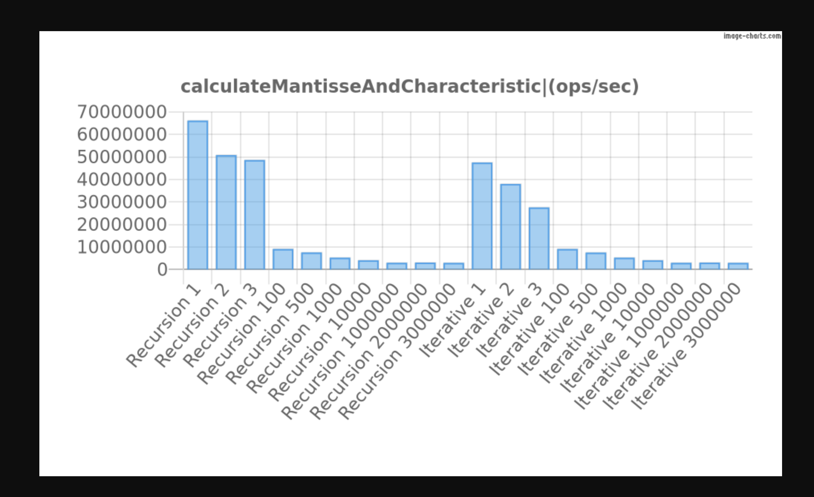

# Logarithms

By definition, a logarithm is an aritmetic function that allows you to find the exponent also known as power to which a base must be raised to yield a given number.

In many Algorithms, when analyzing the growth rate of the runtime of a specific implementation, is very common to find rates that can be expressed in logarithmic terms, usually by using Big O notation, you will find things like O(Log(n)) or O((n)Log(n)).

Beyond that, I'm very curious about what a Logarithm is telling you about something.

Thi section is dedicated to them, I will keep adding as much as I can.

## Available Algorithms

- Calculate the Mantissa and Characteristic of Base 10 Logarithms

Run the test suite:

```js

 node logarithms/parts.test.mjs

```

## Analysis

Run Benchmarks for the different Algorithms via

```js
node logarithms/benchmark.mjs
```


